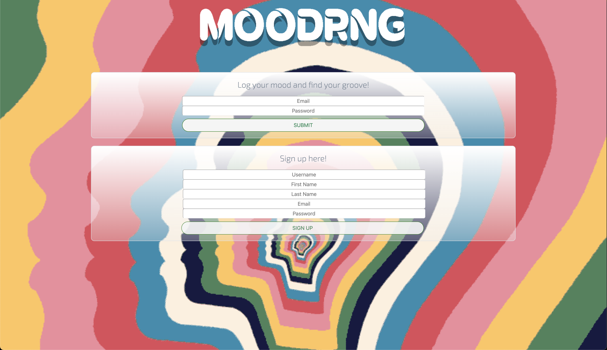
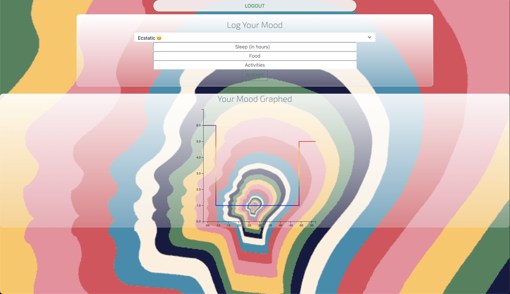

# MoodRng - Mood Tracker 
  
## Description

MoodRng is a web app that allows users to track mood over time. Users log their mood, amount of sleep, recent meals, and activities. Their data is then graphed using a mood-scale of 1-6 over time. Their graphed data allows users to see what's brought their mood up and what's brought it down, because we all want a happier life. 

GitHub Repo: [MoodRng](https://github.com/a-breezy/MoodRng)
Fully deployed: [moodrng.com](https://moodrngwellnessapp.herokuapp.com/)

## Table of Contents

  * [Installation](#installation-instructions)
  * [Usage](#usage)
  * [License](#license)
  * [Collaborators](#collaborators)
  * [How to Contribute](#how-to-contribute)
  * [Questions](#questions)

## Installation Instructions

No installation required visit [moodrng.com](https://moodrngwellnessapp.herokuapp.com/)

---
## Usage

*MoodRng Homepage*

*User Logged In*

---
## License

  [License: MIT](https://opensource.org/licenses/MIT)
  
---
## Collaborators

[a-breezy](https://github.com/a-breezy)
[antger78](https://github.com/antger78)
[jillsuarez](https://github.com/jillsuarez)
[mariovillaquiran](https://github.com/mariovillaquiran)
[mloercher](https://github.com/mloercher)

---
## How to Contribute

None

---
## Questions

ambrose.wilkins@gmail.com
